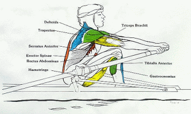
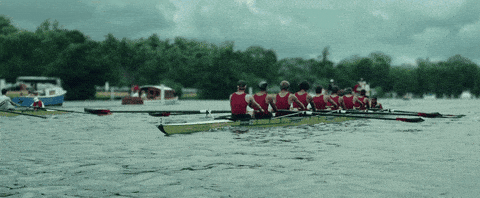
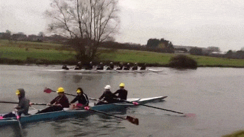

# L'aviron

[Vincent Boutour](https://vibioh.fr)

## Un sport de choix

Le sport dans lequel vous vous dépensez le plus

Un sport complet

* natation 🏊‍
* escalade 🧗‍
* aviron 🚣‍

Un sport de glisse, de fainéant, d'exigences.

Un sport aux multiples configurations

* Nombre de rameurs (1, 2, 4, 5, 9)
* Nombre d'avirons : pointe (1) ou pair (2)
* Position dans le bateau
* Type de coques : yolette ou *outrigger*

Un sport olympique depuis toujours. Un sport peu médiatique.

Un des rares sport où lorsqu'on gagne, on voit ceux devant qui on est.

Pour pratiquer l'aviron, il faut savoir :

* transformer sa force en mouvement dans l'eau
* gérer sa glisse, i.e. ne pas se freiner
* diriger l'embarcation
* regarder où on va

Si on pratique seul, il faut donc savoir faire tout ça.

Le skiff permet de bien progresser.

## Ma pratique

> Je fais du HS8X+

* **H** ommes
* **S** enior
* **8** personnes
* **X** = deux avirons
* **+** un barreur

Le bateau mesure 18 mètres de long.

> Un immeuble de 7 étages

> 4 Renault Clio mises à bout à bout

Le bateau est large de 60 centimètres.

> Juste la place de s'asseoir, pas plus.

L'envergure du bateau est d'environ 7 mètres.

> Une pelle mesure 3 mètres.

Le bateau, à vide, pèse **au minimum** 96 kg.

> On a donc 800 kg à déplacer sur l'eau.

Le bateau coûte 60 000€

> 4 Renault Clio

### Le 8

Il y a 9 places assises, avec chacune un rôle.

> La nage

Il donne le rythme.

Il écoute les autres.

Tout le monde le voit et s'aligne sur lui.

> Le 2

Il supporte la nage.

Il fait tampon avec le reste du bateau.

> Les 3, 4, 5, 6

Ils "font", ils envoient du pâté.

> Le 7 et le 8

Ils s'assurent de l'équilibre du bateau.

> Le barreur

Il nous surveille.

Il nous dirige.

Il nous mesure.

## Pourquoi je vous parle de ça ?

J'occupe la nage, l'as, le 1.

Je suis donc le rameur le plus à l'arrière du bateau.

### Ça ressemble pas mal à nos *impacts team*

* "*2 pizzas team*"

* chacun est essentiel au *dispositif*

* tout le monde doit contribuer à son niveau

* tout le monde va dans la même direction, en même temps

### Ça ressemble à l'informatique

* on donne beaucoup de force pendant un temps.

* on revient doucement sur sa coulisse, on respire

# Références

* [En 8 majeur](https://www.youtube.com/watch?v=8AwyHTgjagQ)

* [Les sports les plus efficaces selon GQ](https://www.gqmagazine.fr/ego-beau/le-coach-gq/diaporama/le-top-10-des-sports-les-plus-efficaces/1980)

## Merci

